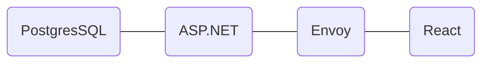

# :paintbrush: Painting Together Is The Dream

## :scroll: Introduction

This repository serves as a platform where **multiple** people can draw pixelated graphics at the **same** time on the **same** board. The backend uses [ASP.NET](https://dotnet.microsoft.com/en-us/apps/aspnet) while the frontend uses [React](https://react.dev/). The communication is ensured via [gRPC](https://grpc.io/). The whole project is served via [Docker](https://www.docker.com/).

### Requirements

Make sure you have installed [Docker](https://docs.docker.com/engine/install/) in order to run the full application.

If you want to make modifications and test the backend, you need to install [ASP.NET 8.0](https://dotnet.microsoft.com/en-us/download/dotnet/8.0).

In order to build the frontend for Docker you need to install [Node.js](https://nodejs.org/en/download/).

### Quick Start

To quickly test the whole project, move to the folder *./paint-dream-web* and run the commands:

```
yarn && yarn build
```

Afterwards, you have to execute the command to run the whole project: 

```
docker compose up -d
```

> :warning: Always make sure to adapt the volume mapping for the database or delete it.

## :classical_building: Architecture

The [PostgreSQL](https://www.postgresql.org/) **database** always runs as a Docker container.

The ASP.NET **backend** reads data from the database and exposes a gRPC API.

[Envoy](https://www.envoyproxy.io/) serves as a **proxy** to translate HTTP/1.1 calls from the browser to HTTP/2. This is necessary as the browser only supports HTTP/1.1 and gRPC is based on HTTP/2. The proxy also always runs as a Docker container.

The React **frontend** written in Typescript is bundled by [Vite](https://vitejs.dev/).



## :test_tube: Modify And Testing

Usually, the PostgreSQL database and the Envoy proxy are running fine on their own. If you want to make changes or debug the backend or frontend, you can just stop the corresponding Docker containers and start them locally with your IDE. The backend can be found in *./PaintDreamBackend* while the frontend is contained in *./paint-dream-web*.

## :dart: Afterwords

I really like to browse through different frameworks and make them work together. The joy when you make new things work and solve issues after being stuck for a while is just great.

If, for whatever reason, you stumble upon my repository, feel free to test things. I am always open for discussion :grin: